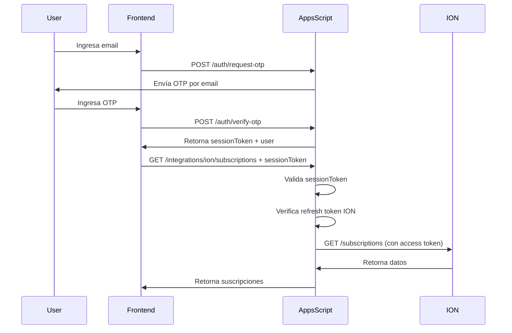

# GUÍA DE CONFIGURACIÓN DE UI - INTEGRACIÓN ION CON TDSYNNEX

## 📋 TABLA DE CONTENIDOS

1. [Arquitectura del Backend](#arquitectura-del-backend)
2. [Autenticación](#autenticación)
3. [Estructura de Llamadas](#estructura-de-llamadas)
4. [Endpoints Disponibles](#endpoints-disponibles)
5. [Ejemplos de Implementación en Frontend](#ejemplos-de-implementación-en-frontend)
6. [Manejo de Errores](#manejo-de-errores)
7. [Best Practices](#best-practices)

---

## 🏗️ ARQUITECTURA DEL BACKEND

### Stack Tecnológico

```
Frontend (Vercel/Next.js)
    ↓ HTTPS
Apps Script Web App (Google)
    ↓
Google Sheets (Base de Datos)
    +
StreamOne ION API (TDSynnex)
```

### URL Base del Backend

```
https://script.google.com/macros/s/AKfycbxMIFYo9MEN9C3AE56B184h0dW-CaVzG2-YnN1CoqHhFGfLwa_Ti3EdKuGxP4S4gfLXtQ/exec
```

### Estructura de Rutas

El backend usa un sistema de routing basado en el parámetro `path`:

```
?path=/ruta/del/endpoint
```

---

## 🔐 AUTENTICACIÓN

### Sistema de Autenticación: OTP (One-Time Password)

#### 1. Solicitar OTP

**Endpoint:** `/auth/request-otp`

**Método:** `POST`

**Request:**
```javascript
fetch(baseUrl + '?path=/auth/request-otp', {
  method: 'POST',
  headers: {
    'Content-Type': 'application/json'
  },
  body: JSON.stringify({
    email: 'usuario@empresa.com'
  })
})
```

**Response:**
```json
{
  "ok": true,
  "message": "OTP sent to email"
}
```

#### 2. Verificar OTP y Obtener Session Token

**Endpoint:** `/auth/verify-otp`

**Método:** `POST`

**Request:**
```javascript
fetch(baseUrl + '?path=/auth/verify-otp', {
  method: 'POST',
  headers: {
    'Content-Type': 'application/json'
  },
  body: JSON.stringify({
    email: 'usuario@empresa.com',
    otp: '123456'
  })
})
```

**Response:**
```json
{
  "ok": true,
  "token": "eyJlbWFpbCI6InVzZXJAZW1haWwuY29tIiwidXNlcklkIjoiVVNSLTEyMyIsInJvbGUiOiJVc2VyIiwib3JnSWQiOiJPUkctNDU2IiwiZXhwIjoxNzY4NTMzNjg3MjQzfQ==.HFF4rnhEdO09WdUajDX1TnPZouRKwnsxGYsptMBTs3o=",
  "user": {
    "email": "usuario@empresa.com",
    "userId": "USR-123",
    "role": "User",
    "orgId": "ORG-456"
  }
}
```

### Uso del Session Token

Una vez obtenido el `sessionToken`, debes incluirlo en TODAS las llamadas protegidas:

**Opción A: Query Parameter (Recomendado para GET)**
```javascript
const url = `${baseUrl}?path=/endpoint&sessionToken=${token}&param1=value1`;
```

**Opción B: Body (Para POST)**
```javascript
fetch(url, {
  method: 'POST',
  headers: { 'Content-Type': 'application/json' },
  body: JSON.stringify({
    sessionToken: token,
    // otros parámetros...
  })
})
```

### Expiración del Token

- El `sessionToken` expira según el valor del campo `exp` (timestamp en milisegundos)
- Cuando expire, el usuario debe solicitar un nuevo OTP

---

## 📡 ESTRUCTURA DE LLAMADAS

### Anatomía de una Llamada

```
https://script.google.com/macros/s/.../exec
  ?path=/integrations/ion/subscriptions     ← Endpoint
  &sessionToken=eyJ...                       ← Autenticación
  &subscriptionStatus=Active                 ← Filtro 1
  &cloudProviderName=Microsoft               ← Filtro 2
  &pagination.limit=50                       ← Paginación
  &pagination.offset=0                       ← Paginación
```

### Parámetros Reservados (NO enviar a endpoints de ION)

Estos parámetros son para el router interno y se filtran automáticamente:

- `path` - Define el endpoint
- `sessionToken` - Autenticación
- `token` - Backward compatibility
- `callback` - JSONP support

### Formato de Respuestas

**Éxito:**
```json
{
  "ok": true,
  "data": { ... }
}
```

**Error:**
```json
{
  "error": "Descripción del error"
}
```

---

## 🎯 ENDPOINTS DISPONIBLES

### 1. SUSCRIPCIONES

#### Listar Suscripciones

**Endpoint:** `/integrations/ion/subscriptions`

**Método:** `GET`

**URL Completa:**
```
{baseUrl}?path=/integrations/ion/subscriptions&sessionToken={token}&{filtros}
```

**Filtros Disponibles:**

| Parámetro | Tipo | Descripción | Ejemplo |
|-----------|------|-------------|---------|
| `subscriptionStatus` | string | Estado de suscripción | `Active`, `Suspended`, `Cancelled` |
| `customerId` | string | ID del cliente | `CUST-12345` |
| `cloudProviderName` | string | Proveedor cloud | `Microsoft`, `AWS`, `Google` |
| `billingCycle` | string | Ciclo de facturación | `Monthly`, `Annual` |
| `subscriptionName` | string | Nombre de suscripción | `Office%20365` |
| `customerName` | string | Nombre del cliente | `Acme%20Corp` |
| `pagination.limit` | number | Resultados por página | `50` (default: `50`) |
| `pagination.offset` | number | Saltar N resultados | `0` (default: `0`) |

**Ejemplos de Uso:**

```javascript
// Todas las suscripciones activas
const url = `${baseUrl}?path=/integrations/ion/subscriptions&sessionToken=${token}&subscriptionStatus=Active&pagination.limit=50&pagination.offset=0`;

// Suscripciones activas de Microsoft
const url = `${baseUrl}?path=/integrations/ion/subscriptions&sessionToken=${token}&subscriptionStatus=Active&cloudProviderName=Microsoft&pagination.limit=50`;

// Suscripciones de un cliente específico
const url = `${baseUrl}?path=/integrations/ion/subscriptions&sessionToken=${token}&customerId=CUST-123&pagination.limit=100`;
```

**Respuesta:**
```json
{
  "ok": true,
  "orgId": "ORG-b0349625-b2fa-4f07-a724-2a2e6a361c1e",
  "count": 25,
  "data": {
    "items": [
      {
        "subscriptionId": "SUB-001",
        "customerId": "CUST-123",
        "subscriptionStatus": "Active",
        "cloudProviderName": "Microsoft",
        "subscriptionName": "Microsoft 365 Business",
        "billingCycle": "Monthly",
        "startDate": "2025-12-01",
        "endDate": "2026-12-01",
        "totalLicense": 10,
        "customerName": "Acme Corporation",
        "resellerName": "TDSynnex",
        "providerProductId": "CFQ7TTC0LF8Q:0001"
      }
      // ... más suscripciones
    ],
    "pagination": {
      "limit": 50,
      "offset": 0,
      "total": 25
    }
  }
}
```

### 2. REPORTS (Para Facturas/Invoices)

**Nota Importante:** ION no tiene un endpoint específico de "invoices". Las facturas se obtienen a través del sistema de **Reports**.

#### Listar Reports Disponibles

**Endpoint:** `/integrations/ion/reports`

**Método:** `GET`

**URL:**
```
{baseUrl}?path=/integrations/ion/reports&sessionToken={token}&module=BILLING
```

**Parámetros:**

| Parámetro | Tipo | Descripción | Ejemplo |
|-----------|------|-------------|---------|
| `module` | string | Módulo de reports | `BILLING`, `USAGE`, `FINANCE` |

**Respuesta:**
```json
{
  "ok": true,
  "data": {
    "reports": [
      {
        "reportId": "RPT-001",
        "reportTemplateId": "TMPL-INVOICE",
        "displayName": "Monthly Invoices",
        "category": "BILLING",
        "description": "Monthly billing invoices report"
      },
      {
        "reportId": "RPT-002",
        "reportTemplateId": "TMPL-USAGE",
        "displayName": "Usage Report",
        "category": "USAGE"
      }
    ]
  }
}
```

#### Obtener Datos de un Report

**Endpoint:** `/integrations/ion/reports/{reportId}/data`

**Método:** `POST`

**URL:**
```
{baseUrl}?path=/integrations/ion/reports/{reportId}/data&sessionToken={token}
```

**Body:**
```json
{
  "dateRange": {
    "startDate": "2026-01-01",
    "endDate": "2026-01-31"
  },
  "filters": {
    "customerId": "CUST-123"
  }
}
```

**Nota:** Este endpoint requiere implementación adicional en el backend. Ver sección de "Endpoints a Implementar".

### 3. CLIENTES

#### Listar Clientes

**Endpoint:** `/integrations/ion/customers`

**Método:** `GET`

**URL:**
```
{baseUrl}?path=/integrations/ion/customers&sessionToken={token}&pagination.limit=50
```

**Filtros:**

| Parámetro | Tipo | Descripción |
|-----------|------|-------------|
| `customerStatus` | string | Estado del cliente: `Active`, `Suspended` |
| `pagination.limit` | number | Resultados por página |
| `pagination.offset` | number | Offset de resultados |

**Nota:** Este endpoint requiere implementación en el backend (similar a `ionSubscriptions_`).

### 4. ÓRDENES

#### Listar Órdenes

**Endpoint:** `/integrations/ion/orders`

**Método:** `GET`

**URL:**
```
{baseUrl}?path=/integrations/ion/orders&sessionToken={token}&orderStatus=Completed
```

**Filtros:**

| Parámetro | Tipo | Descripción |
|-----------|------|-------------|
| `orderStatus` | string | `Pending`, `Completed`, `Failed` |
| `customerId` | string | Filtrar por cliente |
| `pagination.limit` | number | Resultados por página |

**Nota:** Este endpoint requiere implementación en el backend.

---

## 💻 EJEMPLOS DE IMPLEMENTACIÓN EN FRONTEND

### React/Next.js

#### 1. Setup del Cliente API

```typescript
// lib/api/ionClient.ts
const ION_BASE_URL = process.env.NEXT_PUBLIC_ION_API_URL;

interface ApiResponse<T> {
  ok: boolean;
  data?: T;
  error?: string;
}

export class IonApiClient {
  private sessionToken: string;

  constructor(sessionToken: string) {
    this.sessionToken = sessionToken;
  }

  private buildUrl(path: string, params: Record<string, any> = {}): string {
    const url = new URL(ION_BASE_URL);
    url.searchParams.set('path', path);
    url.searchParams.set('sessionToken', this.sessionToken);

    // Añadir parámetros adicionales
    Object.entries(params).forEach(([key, value]) => {
      if (value !== undefined && value !== null && value !== '') {
        url.searchParams.set(key, String(value));
      }
    });

    return url.toString();
  }

  async get<T>(path: string, params?: Record<string, any>): Promise<ApiResponse<T>> {
    try {
      const url = this.buildUrl(path, params);
      const response = await fetch(url, {
        method: 'GET',
        headers: {
          'Content-Type': 'application/json',
        },
      });

      const data = await response.json();
      return data;
    } catch (error) {
      return {
        ok: false,
        error: error instanceof Error ? error.message : 'Unknown error',
      };
    }
  }

  async post<T>(path: string, body: any): Promise<ApiResponse<T>> {
    try {
      const url = this.buildUrl(path);
      const response = await fetch(url, {
        method: 'POST',
        headers: {
          'Content-Type': 'application/json',
        },
        body: JSON.stringify({
          sessionToken: this.sessionToken,
          ...body,
        }),
      });

      const data = await response.json();
      return data;
    } catch (error) {
      return {
        ok: false,
        error: error instanceof Error ? error.message : 'Unknown error',
      };
    }
  }
}
```

#### 2. Hook de Autenticación

```typescript
// hooks/useAuth.ts
import { useState, useEffect } from 'react';

interface User {
  email: string;
  userId: string;
  role: string;
  orgId: string;
}

interface AuthState {
  user: User | null;
  token: string | null;
  isAuthenticated: boolean;
  isLoading: boolean;
}

export function useAuth() {
  const [authState, setAuthState] = useState<AuthState>({
    user: null,
    token: null,
    isAuthenticated: false,
    isLoading: true,
  });

  useEffect(() => {
    // Cargar token del localStorage al montar
    const token = localStorage.getItem('sessionToken');
    const userStr = localStorage.getItem('user');

    if (token && userStr) {
      try {
        const user = JSON.parse(userStr);
        setAuthState({
          user,
          token,
          isAuthenticated: true,
          isLoading: false,
        });
      } catch {
        localStorage.removeItem('sessionToken');
        localStorage.removeItem('user');
        setAuthState({
          user: null,
          token: null,
          isAuthenticated: false,
          isLoading: false,
        });
      }
    } else {
      setAuthState({
        user: null,
        token: null,
        isAuthenticated: false,
        isLoading: false,
      });
    }
  }, []);

  const requestOtp = async (email: string) => {
    const response = await fetch(
      `${process.env.NEXT_PUBLIC_ION_API_URL}?path=/auth/request-otp`,
      {
        method: 'POST',
        headers: { 'Content-Type': 'application/json' },
        body: JSON.stringify({ email }),
      }
    );
    return response.json();
  };

  const verifyOtp = async (email: string, otp: string) => {
    const response = await fetch(
      `${process.env.NEXT_PUBLIC_ION_API_URL}?path=/auth/verify-otp`,
      {
        method: 'POST',
        headers: { 'Content-Type': 'application/json' },
        body: JSON.stringify({ email, otp }),
      }
    );

    const data = await response.json();

    if (data.ok && data.token) {
      localStorage.setItem('sessionToken', data.token);
      localStorage.setItem('user', JSON.stringify(data.user));
      setAuthState({
        user: data.user,
        token: data.token,
        isAuthenticated: true,
        isLoading: false,
      });
    }

    return data;
  };

  const logout = () => {
    localStorage.removeItem('sessionToken');
    localStorage.removeItem('user');
    setAuthState({
      user: null,
      token: null,
      isAuthenticated: false,
      isLoading: false,
    });
  };

  return {
    ...authState,
    requestOtp,
    verifyOtp,
    logout,
  };
}
```

#### 3. Hook para Suscripciones

```typescript
// hooks/useSubscriptions.ts
import { useState, useEffect } from 'react';
import { IonApiClient } from '@/lib/api/ionClient';

interface SubscriptionFilters {
  subscriptionStatus?: 'Active' | 'Suspended' | 'Cancelled';
  cloudProviderName?: 'Microsoft' | 'AWS' | 'Google';
  customerId?: string;
  customerName?: string;
  limit?: number;
  offset?: number;
}

interface Subscription {
  subscriptionId: string;
  customerId: string;
  subscriptionStatus: string;
  cloudProviderName: string;
  subscriptionName: string;
  billingCycle: string;
  startDate: string;
  endDate?: string;
  totalLicense: number;
  customerName: string;
}

interface SubscriptionsResponse {
  items: Subscription[];
  pagination: {
    limit: number;
    offset: number;
    total: number;
  };
}

export function useSubscriptions(token: string, filters: SubscriptionFilters = {}) {
  const [subscriptions, setSubscriptions] = useState<Subscription[]>([]);
  const [pagination, setPagination] = useState({ limit: 50, offset: 0, total: 0 });
  const [isLoading, setIsLoading] = useState(true);
  const [error, setError] = useState<string | null>(null);

  const fetchSubscriptions = async () => {
    setIsLoading(true);
    setError(null);

    const client = new IonApiClient(token);
    
    const params: Record<string, any> = {
      'pagination.limit': filters.limit || 50,
      'pagination.offset': filters.offset || 0,
    };

    if (filters.subscriptionStatus) {
      params.subscriptionStatus = filters.subscriptionStatus;
    }
    if (filters.cloudProviderName) {
      params.cloudProviderName = filters.cloudProviderName;
    }
    if (filters.customerId) {
      params.customerId = filters.customerId;
    }
    if (filters.customerName) {
      params.customerName = filters.customerName;
    }

    const response = await client.get<SubscriptionsResponse>(
      '/integrations/ion/subscriptions',
      params
    );

    if (response.ok && response.data) {
      setSubscriptions(response.data.items);
      setPagination(response.data.pagination);
    } else {
      setError(response.error || 'Failed to fetch subscriptions');
    }

    setIsLoading(false);
  };

  useEffect(() => {
    if (token) {
      fetchSubscriptions();
    }
  }, [token, filters.subscriptionStatus, filters.cloudProviderName, filters.limit, filters.offset]);

  return {
    subscriptions,
    pagination,
    isLoading,
    error,
    refetch: fetchSubscriptions,
  };
}
```

#### 4. Componente de Lista de Suscripciones

```tsx
// components/SubscriptionsList.tsx
'use client';

import { useState } from 'react';
import { useAuth } from '@/hooks/useAuth';
import { useSubscriptions } from '@/hooks/useSubscriptions';

export function SubscriptionsList() {
  const { token } = useAuth();
  const [filters, setFilters] = useState({
    subscriptionStatus: 'Active' as const,
    cloudProviderName: undefined as 'Microsoft' | 'AWS' | 'Google' | undefined,
    limit: 50,
    offset: 0,
  });

  const { subscriptions, pagination, isLoading, error, refetch } = useSubscriptions(
    token!,
    filters
  );

  if (isLoading) {
    return <div>Loading subscriptions...</div>;
  }

  if (error) {
    return <div>Error: {error}</div>;
  }

  return (
    <div className="space-y-4">
      {/* Filtros */}
      <div className="flex gap-4">
        <select
          value={filters.subscriptionStatus}
          onChange={(e) =>
            setFilters({ ...filters, subscriptionStatus: e.target.value as any, offset: 0 })
          }
          className="border rounded px-3 py-2"
        >
          <option value="Active">Active</option>
          <option value="Suspended">Suspended</option>
          <option value="Cancelled">Cancelled</option>
        </select>

        <select
          value={filters.cloudProviderName || ''}
          onChange={(e) =>
            setFilters({ ...filters, cloudProviderName: e.target.value as any, offset: 0 })
          }
          className="border rounded px-3 py-2"
        >
          <option value="">All Providers</option>
          <option value="Microsoft">Microsoft</option>
          <option value="AWS">AWS</option>
          <option value="Google">Google</option>
        </select>

        <button
          onClick={refetch}
          className="px-4 py-2 bg-blue-500 text-white rounded hover:bg-blue-600"
        >
          Refresh
        </button>
      </div>

      {/* Tabla */}
      <table className="w-full border-collapse">
        <thead>
          <tr className="bg-gray-100">
            <th className="border p-2 text-left">Subscription ID</th>
            <th className="border p-2 text-left">Customer</th>
            <th className="border p-2 text-left">Product</th>
            <th className="border p-2 text-left">Provider</th>
            <th className="border p-2 text-left">Status</th>
            <th className="border p-2 text-left">Billing</th>
            <th className="border p-2 text-left">Licenses</th>
          </tr>
        </thead>
        <tbody>
          {subscriptions.map((sub) => (
            <tr key={sub.subscriptionId} className="hover:bg-gray-50">
              <td className="border p-2">{sub.subscriptionId}</td>
              <td className="border p-2">{sub.customerName}</td>
              <td className="border p-2">{sub.subscriptionName}</td>
              <td className="border p-2">{sub.cloudProviderName}</td>
              <td className="border p-2">
                <span
                  className={`px-2 py-1 rounded text-sm ${
                    sub.subscriptionStatus === 'Active'
                      ? 'bg-green-100 text-green-800'
                      : 'bg-gray-100 text-gray-800'
                  }`}
                >
                  {sub.subscriptionStatus}
                </span>
              </td>
              <td className="border p-2">{sub.billingCycle}</td>
              <td className="border p-2">{sub.totalLicense}</td>
            </tr>
          ))}
        </tbody>
      </table>

      {/* Paginación */}
      <div className="flex justify-between items-center">
        <div>
          Showing {pagination.offset + 1} to {Math.min(pagination.offset + pagination.limit, pagination.total)} of {pagination.total}
        </div>
        <div className="flex gap-2">
          <button
            onClick={() => setFilters({ ...filters, offset: Math.max(0, filters.offset - filters.limit) })}
            disabled={filters.offset === 0}
            className="px-4 py-2 border rounded disabled:opacity-50"
          >
            Previous
          </button>
          <button
            onClick={() => setFilters({ ...filters, offset: filters.offset + filters.limit })}
            disabled={filters.offset + filters.limit >= pagination.total}
            className="px-4 py-2 border rounded disabled:opacity-50"
          >
            Next
          </button>
        </div>
      </div>
    </div>
  );
}
```

---

## ⚠️ MANEJO DE ERRORES

### Tipos de Errores Comunes

| Error | Causa | Solución |
|-------|-------|----------|
| `Missing sessionToken` | Token no enviado | Incluir token en todas las llamadas |
| `Firma inválida` | Token corrupto o expirado | Solicitar nuevo OTP |
| `Token expired` | Token caducado | Solicitar nuevo OTP |
| `ION: conexión no encontrada` | Usuario sin conexión ION | Configurar ION primero |
| `ION request failed (HTTP 401)` | Refresh token expirado | Reconectar ION |
| `ION request failed (HTTP 400)` | Parámetros inválidos | Revisar filtros enviados |

### Manejo en Frontend

```typescript
async function handleApiCall<T>(
  apiCall: () => Promise<ApiResponse<T>>
): Promise<T> {
  const response = await apiCall();

  if (!response.ok) {
    // Token expirado
    if (response.error?.includes('Token expired') || 
        response.error?.includes('Firma inválida')) {
      // Redirigir a login
      window.location.href = '/login';
      throw new Error('Session expired. Please login again.');
    }

    // Conexión ION no configurada
    if (response.error?.includes('conexión no encontrada')) {
      throw new Error('ION connection not configured. Please contact support.');
    }

    // Refresh token expirado
    if (response.error?.includes('HTTP 401')) {
      throw new Error('ION connection expired. Please reconnect ION.');
    }

    // Error genérico
    throw new Error(response.error || 'An error occurred');
  }

  return response.data!;
}
```

---

## ✅ BEST PRACTICES

### 1. Gestión de Tokens

```typescript
// ✅ BIEN: Almacenar en localStorage con verificación
const saveToken = (token: string) => {
  try {
    localStorage.setItem('sessionToken', token);
  } catch (e) {
    console.error('Failed to save token:', e);
  }
};

// ✅ BIEN: Verificar expiración antes de usar
const isTokenValid = (token: string): boolean => {
  try {
    const [payload] = token.split('.');
    const decoded = JSON.parse(atob(payload));
    return decoded.exp > Date.now();
  } catch {
    return false;
  }
};
```

### 2. Paginación

```typescript
// ✅ BIEN: Implementar scroll infinito o paginación tradicional
const loadMore = () => {
  setFilters(prev => ({
    ...prev,
    offset: prev.offset + prev.limit
  }));
};

// ✅ BIEN: Mostrar loading state durante carga
if (isLoading && subscriptions.length === 0) {
  return <Skeleton />;
}
```

### 3. Caché de Datos

```typescript
// ✅ BIEN: Usar React Query para caché automático
import { useQuery } from '@tanstack/react-query';

const { data, isLoading } = useQuery({
  queryKey: ['subscriptions', filters],
  queryFn: () => fetchSubscriptions(filters),
  staleTime: 5 * 60 * 1000, // 5 minutos
});
```

### 4. Filtros en URL

```typescript
// ✅ BIEN: Persistir filtros en URL para compartir
const router = useRouter();
const searchParams = useSearchParams();

const updateFilters = (newFilters: SubscriptionFilters) => {
  const params = new URLSearchParams(searchParams);
  params.set('status', newFilters.subscriptionStatus || '');
  params.set('provider', newFilters.cloudProviderName || '');
  router.push(`?${params.toString()}`);
};
```

### 5. Manejo de Errores

```typescript
// ✅ BIEN: Mostrar errores al usuario de forma amigable
if (error) {
  return (
    <div className="bg-red-50 border border-red-200 rounded p-4">
      <p className="text-red-800">
        {error.includes('401') 
          ? 'Your session has expired. Please login again.'
          : 'An error occurred. Please try again.'}
      </p>
      <button onClick={refetch} className="mt-2 text-red-600 underline">
        Retry
      </button>
    </div>
  );
}
```

---

## 📝 ENDPOINTS A IMPLEMENTAR EN BACKEND

Los siguientes endpoints aún NO están implementados pero siguen el mismo patrón:

### 1. Clientes (`/integrations/ion/customers`)
### 2. Órdenes (`/integrations/ion/orders`)
### 3. Reports Data (`/integrations/ion/reports/{reportId}/data`)

Para implementarlos, sigue el patrón de `ionSubscriptions_()`:

```javascript
function ionCustomers_(req, user) {
  const orgId = getOrgIdForIon_(user);
  const rawQuery = (req && req.query) ? req.query : {};
  const cleanQuery = {};
  const internalParams = new Set(['path', 'sessionToken', 'token', 'callback']);
  
  Object.keys(rawQuery).forEach(k => {
    if (!internalParams.has(k)) cleanQuery[k] = rawQuery[k];
  });

  const q = ionNormalizeCustomersQuery_(cleanQuery);
  
  if (!q["pagination.limit"]) q["pagination.limit"] = "50";
  if (!q["pagination.offset"]) q["pagination.offset"] = "0";

  const result = ionRequest_(orgId, "GET", "/customers", { query: q });

  return {
    ok: true,
    orgId,
    count: Array.isArray(result.data?.items) ? result.data.items.length : undefined,
    data: result.data,
  };
}
```

---

## 🔄 FLUJO COMPLETO DE AUTENTICACIÓN E INTEGRACIÓN ION



---

## 📚 RECURSOS ADICIONALES

- **Documentación API ION:** https://docs.ion.tdsynnex.com
- **Portal ION:** https://ion.tdsynnex.com
- **Postman Collection:** (Incluida en archivos adjuntos)

---

## 🚀 PRÓXIMOS PASOS

1. ✅ Implementar autenticación OTP en UI
2. ✅ Crear componente de lista de suscripciones
3. ⏳ Implementar endpoint de clientes
4. ⏳ Implementar endpoint de órdenes
5. ⏳ Implementar sistema de reports/invoices
6. ⏳ Añadir búsqueda y filtros avanzados
7. ⏳ Implementar exportación de datos (CSV/Excel)

---

**Última actualización:** 16 Enero 2026
**Versión:** 1.0
